# 学习pytroch
今天开始学习B站刘二官人的[pytorch深度学习实践](https://www.bilibili.com/video/BV1Y7411d7Ys/?share_source=copy_web&vd_source=a1ffec068250da5848b9cace6cbe7870)

在这里只记录关键笔记，完整详细内容建议观看论文


## Overview
区分模型、网络和框架
* 框架：就是一个开源库，使用的时候直接`import`。例如`pytorch`, `tensorflow`
* 网络：就是一个拓扑结构，一系列函数在其中，表示一层层如何交叉训练得到结果。著名的有：
  * 全连接网络FC 
    
    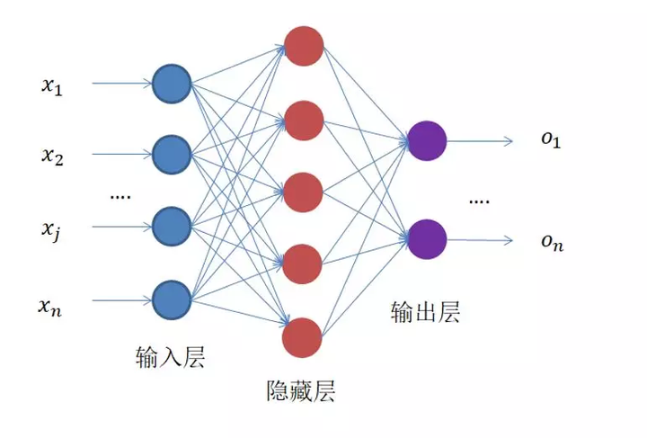
  * 卷积神经网络CNN 
  
    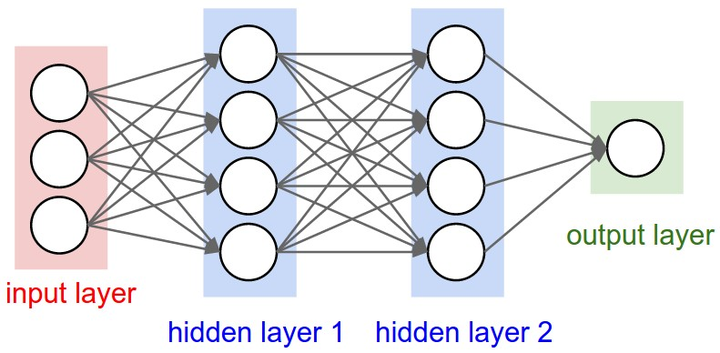
  * 循环神经网络RNN 
  
    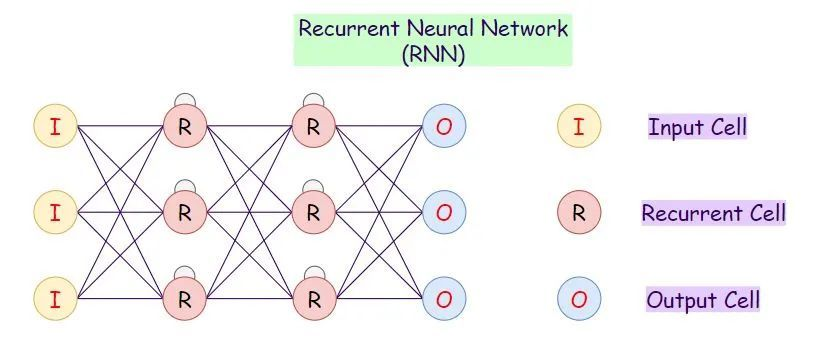
* 模型：可以理解为用网络结构+数据。


## linear model
### 训练集、验证集和测试集
* 训练集：用来给模型进行训练的数据集。
* 验证集：用来给经过训练集训练后的模型进行验证，看看效果如何（btw效果怎么评估有个指标就是下一节写的loss）。
* 测试集：最后用来测试效果的

一般是发放训练集和验证集，或者只给你训练集自己划分出验证集。最后通过测试集看效果。

训练集划分出验证集常用比例：60% 训练集、20% 验证集、20% 测试集。

### 交叉验证
现在流行交叉验证

<strong>什么是交叉验证？</strong>

评估模型是否学会了「某项技能」时，也需要用新的数据来评估，而不是用训练集里的数据来评估。这种「训练集」和「测试集」完全不同的验证方法就是交叉验证法。


<strong>交叉验证的方法</strong>
1. 留出法（Holdout cross validation）

上文提到的，按照固定比例将数据集静态的划分为训练集、验证集、测试集的方式就是留出法。

2. 留一法（Leave one out cross validation）

每次的测试集都只有一个样本，要进行 m 次训练和预测。 这个方法用于训练的数据只比整体数据集少了一个样本，因此最接近原始样本的分布。但是训练复杂度增加了，因为模型的数量与原始数据样本数量相同。 一般在数据缺乏时使用。

3. k 折交叉验证（k-fold cross validation）

静态的「留出法」对数据的划分方式比较敏感，有可能不同的划分方式得到了不同的模型。「k 折交叉验证」是一种动态验证的方式，这种方式可以降低数据划分带来的影响。具体步骤如下：

将数据集分为训练集和测试集，将测试集放在一边
将训练集分为 k 份
每次使用 k 份中的 1 份作为验证集，其他全部作为训练集。
通过 k 次训练后，我们得到了 k 个不同的模型。
评估 k 个模型的效果，从中挑选效果最好的超参数
使用最优的超参数，然后将 k 份数据全部作为训练集重新训练模型，得到最终模型。


### loss
在这里我们引入一个概念叫loss值。他表示预测结果离真实结果的差距

例如：我们现在假设真实的y=2x，模型预测两个分别是y=3x和y=x，如下图所示：


假设模型模拟效果是y=3x

| x | y | predict |
| :----: | :----: | :----: | 
| 1 | 2 | 3 | 
| 2 | 4 | 6 | 
| 3 | 6 | 9 | 


此时预测值和真实y值存在差距，我们将这些差距通过一种方式计算出来称为loss值，实际表示的是预测值和真实值的差距，差距越大则模拟效果越差，差距越小模拟效果越好。

### MSE
<strong>均方差(Mean Square Error-MSE)是计算loss值的一种方式</strong>
1. <strong>计算loss</strong>

  针对单个样本计算损失值： 
  
   $loss=(\hat{y}-y)^2=(x*\omega-y)^2$

假设模型模拟效果是y=3x

| x | y | predict | loss |
| :----: | :----: | :----: | :----: | 
| 1 | 2 | 3 | 1 |
| 2 | 4 | 6 | 4 |
| 3 | 6 | 9 | 9 |

2. <strong>计算损失函数Cost Function</strong>
    
针对全部的训练集计算损失值的函数有很多，均方差(Mean Square Error-MSE)是其中一种:

$Cost \space Function=\frac{1}{N}\sum_{n=1}^N(\hat{y}_n-y_n)^2$

即(每个预测值-真实值)的平方之和/数值总个数。

假设模型模拟效果是y=3x和y=4x

* y = 3x

| x | y | predict | loss |
| :----: | :----: | :----: | :----: | 
| 1 | 2 | 3 | 1 |
| 2 | 4 | 6 | 4 |
| 3 | 6 | 9 | 9 |

* y = 4x
  
| x | y | predict | loss |
| :----: | :----: | :----: | :----: | 
| 1 | 2 | 4 | 4 |
| 2 | 4 | 8 | 16 |
| 3 | 6 | 12 | 36 |

计算MSE如下表所示：

| x | loss(w=3) | loss(w=4) | 
| :----: | :----: | :----: | 
| 1 | 2 | 3 | 
| 2 | 4 | 6 | 
| 3 | 6 | 9 | 
| MSE | 4 | 6 |

### code
1. 假设要拟合线性模型$y = x*\omega$
```
import numpy as np
import matplotlib.pyplot as plt

x_data = [1.0, 2.0, 3.0]
y_data = [2.0, 4.0, 6.0]
#前馈计算
def forward(x):
    return x * w
#求loss
def loss(x, y):
    y_pred = forward(x)
    return (y_pred-y)*(y_pred-y)

w_list = []
mse_list = []
#从0.0一直到4.1以0.1为间隔进行w的取样
for w in np.arange(0.0,4.1,0.1):
    print("w=", w)
    l_sum = 0
    for x_val,y_val in zip(x_data,y_data):
        y_pred_val = forward(x_val)
        loss_val = loss(x_val,y_val)
        l_sum += loss_val
        print('\t',x_val,y_val,y_pred_val,loss_val)
    print("MSE=",l_sum/3)
    w_list.append(w)
    mse_list.append(l_sum/3)

#绘图
plt.plot(w_list,mse_list)
plt.ylabel("Loss")
plt.xlabel('w')
plt.show()
```
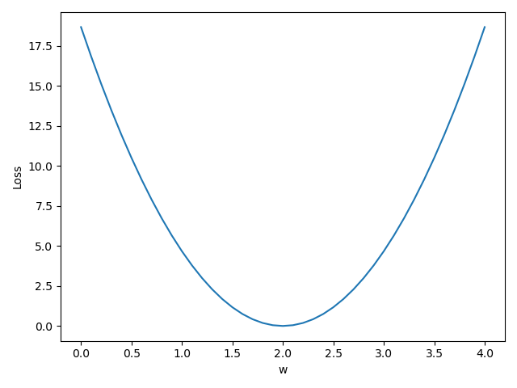


2. 假设要拟合线性模型$y = x*\omega + b$
```
import numpy as np
import matplotlib.pyplot as plt

x_data = [1.0, 2.0, 3.0]
y_data = [2.5, 4.5, 6.5]

def forward(x, w, b):
    return x * w   + b

def loss(x, y, w, b):
    y_pred = forward(x, w, b)
    return (y_pred - y) ** 2

w_list = np.arange(0.0, 4.0, 0.1)
b_list = np.arange(0.0, 4.0, 0.1)
mse_list = []

for w in w_list:
    sub_list = []
    for b in b_list:
        l_sum = 0
        for x_val, y_val in zip(x_data, y_data):
            loss_val = loss(x_val, y_val, w, b)
            l_sum += loss_val
        sub_list.append(l_sum / len(x_data))
    mse_list.append(sub_list)

# 转换为网格数据
X, Y = np.meshgrid(w_list, b_list)
Z = np.array(mse_list)

# 创建图形对象和子图
fig = plt.figure()
ax = fig.add_subplot(111, projection='3d')

# 绘制曲面图
ax.plot_surface(X, Y, Z)

# 设置坐标轴标签
ax.set_xlabel('X-axis')
ax.set_ylabel('Y-axis')
ax.set_zlabel('MSE')

# 显示图形
plt.show()

```
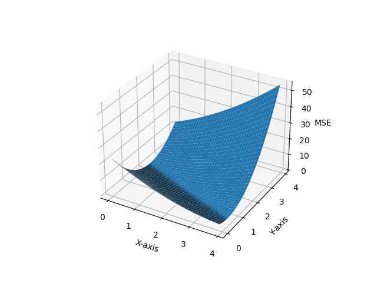


## Gradient Descent
### 一、背景-为什么需要梯度下降
#### 1. 迭代是什么
上一节我们讲到有个衡量预测值与真实值之间的差距从而反映模型好坏的参数叫损失函数*cost function*。因此我们的目标是不断调整参数使得*cost function*越来越小，那么我们首先得知道*cost function*和什么参数有关。

假设拟合的曲线是 $y=x*\omega$, 我们带入*cost function*为： <br>
$cost \space function = \frac{1}{N}\sum_{n=1}^N(\hat{y}_n-y_n)^2=\frac{1}{N}\sum_{n=1}^N(\omega*x_n-y_n)^2$ <br>
显然我们看出*cost function*此时跟参数$\omega$有关。

因此为了求得*cost function*的最小值，我们想到对参数$\omega$求导数，gradient公式如下：<br>
$\begin{aligned}gard=
\frac{\partial cost(\omega)}{\partial\omega}& \begin{aligned}&=\frac{\partial}{\partial\omega}\frac{1}{N}\sum_{n=1}^{N}(x_n\cdot\omega-y_n)^2\end{aligned}  \\
&=\frac1N\sum_{n=1}^N\frac\partial{\partial\omega}(x_n\cdot\omega-y_n)^2 \\
&=\frac1N\sum_{n=1}^N2\cdot(x_n\cdot\omega-y_n)\frac{\partial(x_n\cdot\omega-y_n)}{\partial\omega} \\
&=\frac1N\sum_{n=1}^N2\cdot x_n\cdot(x_n\cdot\omega-y_n)
\end{aligned}$

$\omega的更新公式：\begin{array}{c}\omega=\omega-\alpha\frac{\partial cost}{\partial\omega}=\omega-\alpha*g \\\end{array}=\omega-\alpha\frac1N\sum_{n=1}^N2\cdot x_n\cdot(x_n\cdot\omega-y_n)$

*Notes：当然复杂的函数不止一个参数，$f(\omega_1,\omega_2,\omega_3,...,b)$有$\omega_1$,$\omega_2$,$\omega_3$...,$b$这些参数，我们需要对他们求偏导*

从上面的公式中我们不难看出我们不断的迭代$\omega$使得导数为0就可以求得极大值和极小值（多个参数也是同样的道理），这就是迭代。求得的极小值很有可能就是最小值，但是不一定（可以看出我们基于的是贪心策略）。这就是为什么我们要迭代。


#### 2. 迭代存在的问题
迭代会遇到一些情况：
* 极小值不一定是最小值
  
  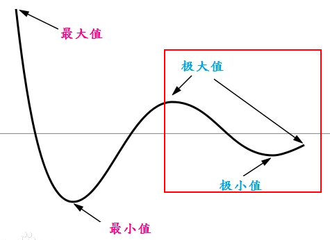

当你在红色的区域不断迭代的时候，损失函数会收敛于极小值，你永远得不到损失函数最小值。

我们一般称这种函数为<strong>非凸函数</strong>，在这种函数中我们可能会得到局部最优，但不一定是全局最优。

<strong>但是为什么现在还是大量采用梯度下降算法呢？</strong>  
因为在深度神经网络损失函数当中并没有非常多的局部最优点，但是会存在一种特殊的点叫鞍点。当然并非所有的损失函数都是<strong>凸函数</strong>，因此现在有个研究方向是<strong>凸优化</strong>。将非凸问题转变为凸问题就好解决了。

* 鞍点
  
  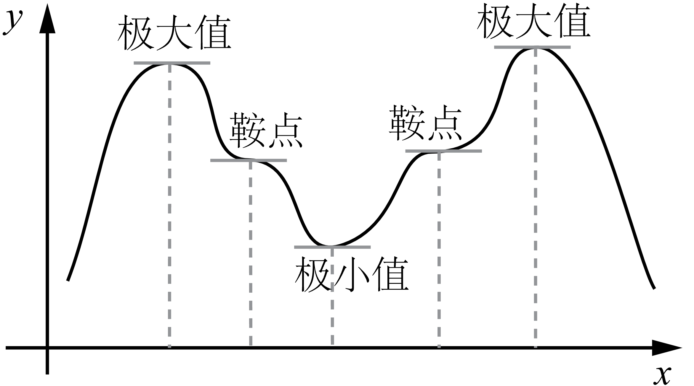


鞍点是在某个方向上导数为0的点，当你到达鞍点的时候梯度为0停止迭代，误以为我们到达了局部最优或者全局最优点。因此我们最要解决的问题是鞍点问题。
  

### 二、Code
接下来我将用python实现梯度下降代码<br>
1. 首先我们定义数据集
```
x_data = [1.0, 2.0, 3.0]
y_data = [2.0, 4.0, 8.0]
```
我们的任务是对`x=4`的`y`进行预测（其实从上面的数据集可以看出来`x=4时,y=8`）
<br>

2. 接下来我们定义前向传播函数forward<br>
forward函数的作用是对输入进行计算后输出。<br>
也就是在这里我们需要定义初始的拟合函数，我们假设是线性模型，定义如下<br>
```
w = 1.0 #Initial value
a = 0.01 #learning rate
def forward(x):
  return w * x
```
<br>


3. 接下来我们定义下损失值<br>
其实损失值对梯度下降来说不重要，但是为了输出模型的效果，我们可以看下每次迭代输出的损失值是多少。<br>
这里我们采用MSE损失函数<br>
根据我们之前推导的数学公式：$cost \space function = \frac{1}{N}\sum_{n=1}^N(\hat{y}_n-y_n)^2=\frac{1}{N}\sum_{n=1}^N(\omega*x_n-y_n)^2$ 
```
def cost(xs, ys):
  cost = 0
  for x, y in zip(xs, ys):
    cost += (forward(x)-y)*(forward(x)-y) 
  return cost / len(xs)
```
<br>

4. 然后我们定义梯度
首先回顾我们之前推导的梯度公式：<br>
$\begin{aligned}gard=
\frac{\partial cost(\omega)}{\partial\omega}& \begin{aligned}&=\frac{\partial}{\partial\omega}\frac{1}{N}\sum_{n=1}^{N}(x_n\cdot\omega-y_n)^2\end{aligned}  \\
&=\frac1N\sum_{n=1}^N\frac\partial{\partial\omega}(x_n\cdot\omega-y_n)^2 \\
&=\frac1N\sum_{n=1}^N2\cdot(x_n\cdot\omega-y_n)\frac{\partial(x_n\cdot\omega-y_n)}{\partial\omega} \\
&=\frac1N\sum_{n=1}^N2\cdot x_n\cdot(x_n\cdot\omega-y_n)
\end{aligned}$
<br>
因此我们将公式实现从而获取这批数据集的梯度<br>
```
def gradient(xs, ys):
  grad = 0
  for x, y in zip(xs, ys):
    grad += 2 * x * (forward(x) - y)
  return grad / len(xs) 
```

5. 最后我们进行梯度下降<br>
   首先回顾梯度下降公式：<br>
   $\begin{array}{c}\omega=\omega-\alpha\frac{\partial cost}{\partial\omega}=\omega-\alpha*g \\\end{array}=\omega-\alpha\frac1N\sum_{n=1}^N2\cdot x_n\cdot(x_n\cdot\omega-y_n)$
   将公式用代码实现:<br>
   ```
   for epoch in range(100):
    cost_value = cost(x_data, y_data)
    grad_value = gradient(x_data, y_data)
    w -= a * grad_value
   ```

6. 画图<br>
   为了输出结果并且将cost值画出来我们添加一些代码组成<strong>完整代码</strong>：
```
import matplotlib.pyplot as plt
x_data = [1.0, 2.0, 3.0]
y_data = [2.0, 4.0, 6.0]

w = 1.0
a = 0.01

def forward(x):
    return w * x

def cost(xs, ys):
    cost = 0
    for x, y in zip(xs, ys):
        y_predict = forward(x)
        cost += (y_predict-y)**2
    return cost / len(xs)

def gradient(xs, ys):
    grad = 0
    for x, y in zip(xs, ys):
        grad += 2*x*(x*w-y)
    return grad / len(xs)

print('predict:(before trainning):', 4, forward(4))
cost_list = []
epoch_list = []
for epoch in range(100):
    epoch_list.append(epoch)
    cost_val = cost(x_data,y_data)
    cost_list.append(cost_val)
    w -= a*gradient(x_data, y_data)
    print("Epoch=",epoch,"w=",w,"loss=",cost_val)
print('predict:(after trainning):', 4, forward(4))

plt.plot(epoch_list,cost_list)
plt.show()
```
结果如图所示：<br>
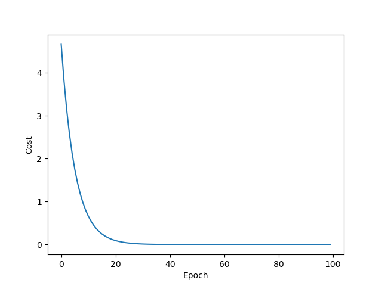
<br>

### 三、result analysis
上面我们得到了梯度下降的模型效果，随着epoch的增加损失值在不断下降。

但是在实际中曲线可能没那么漂亮，局部震荡很大，我们得到的可能是下面的图形：局部震荡很大
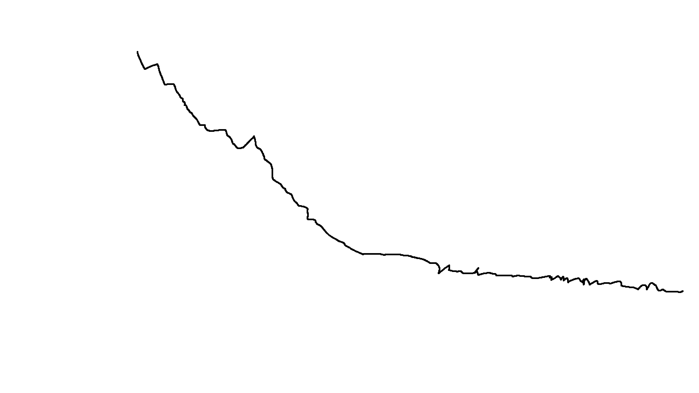

因此我们一般用指数加权均值的方法使得cost function更加平滑。<br>
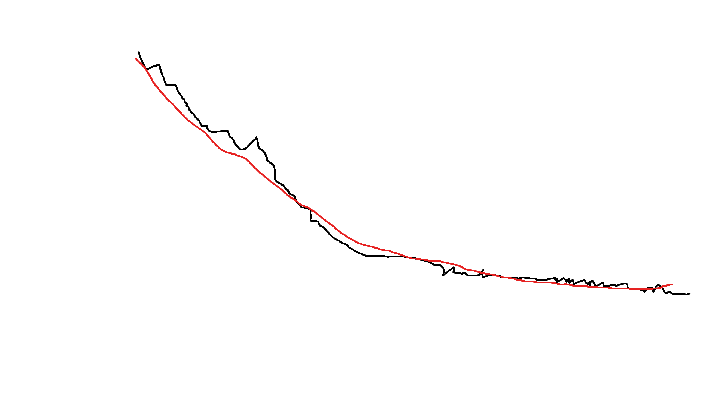

什么是指数加权均值呢？<br>
$C_0^{\prime}  = C_0$ <br>
$C_i^{\prime} = \beta*C_{i}+(1-\beta)*C_{i-1}^{\prime}$ 


### 四、gradient descent vs. stochastic gradient descent vs. batch gradient descent
上面的内容我们了解了什么是梯度下降。
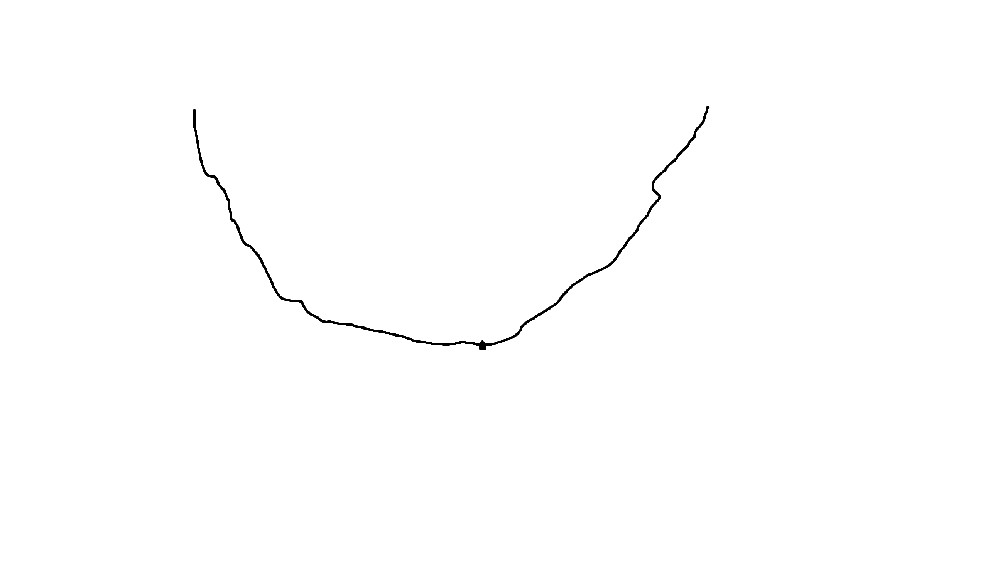

当我们的损失函数变成这样的曲线时，意味着cost function<strong>发散</strong>，训练失败了。

而造成发散的原因有很多，最常见的原因是学习率太大。<br>
学习率可以理解为每次更新迭代的频率
